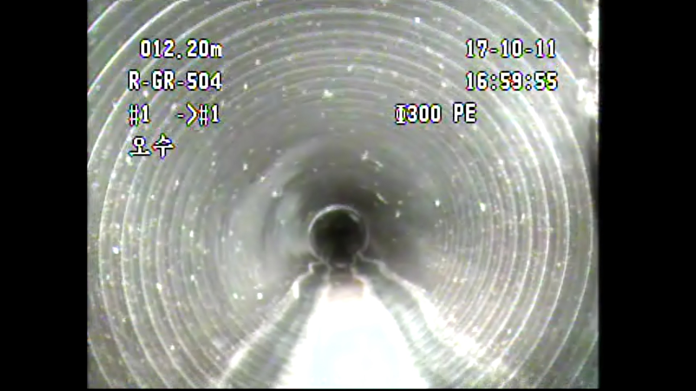
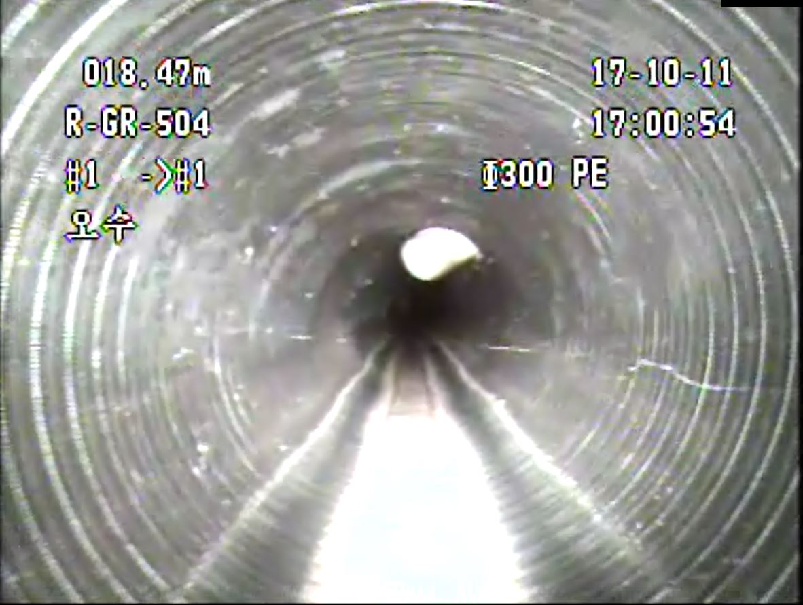
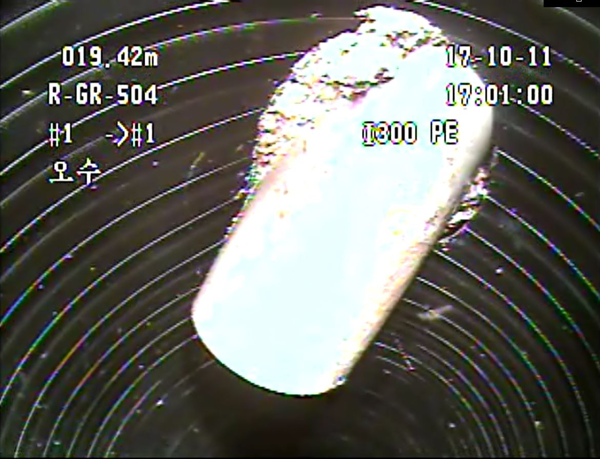

# DeepPipe
Training detection model for defect of Sewer pipe.
This project is based on the KR patent <b>"Apparatus and Method for Detection defect of sewer pipe based on Deep Learning."</b>
which is invented by me and office workers and also owned by [NASSTECH E&C](http://www.nasstech.co.kr/)

The Pipe Defect database is not publicly open yet.
But here is some example of defect images.

---
Pipe, the world seen by CCTV robots

defect: projected

defect: projected (see closer)

